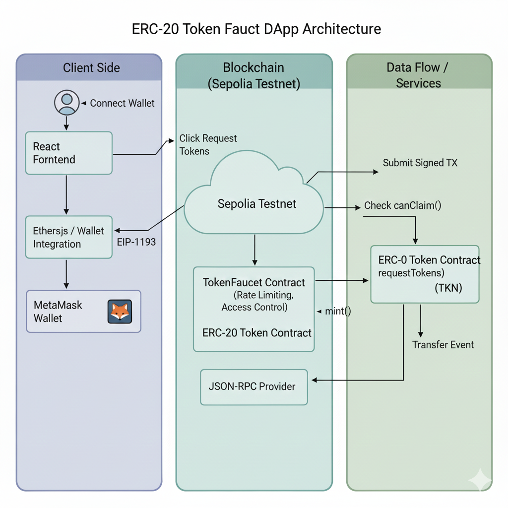
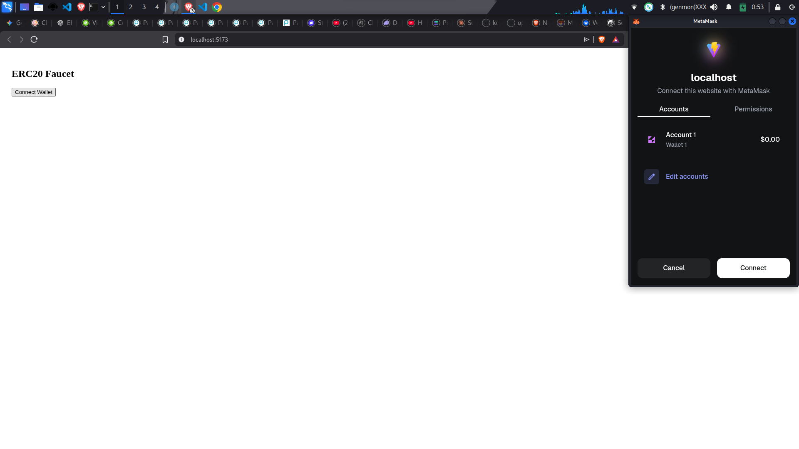
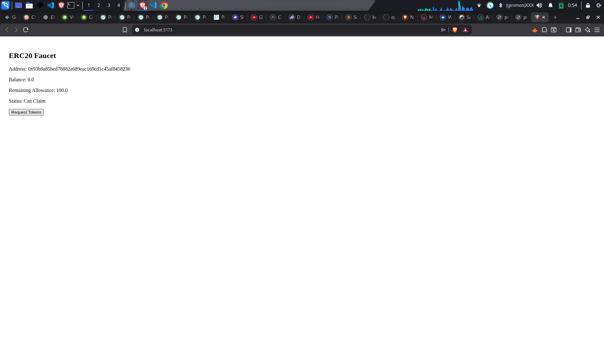
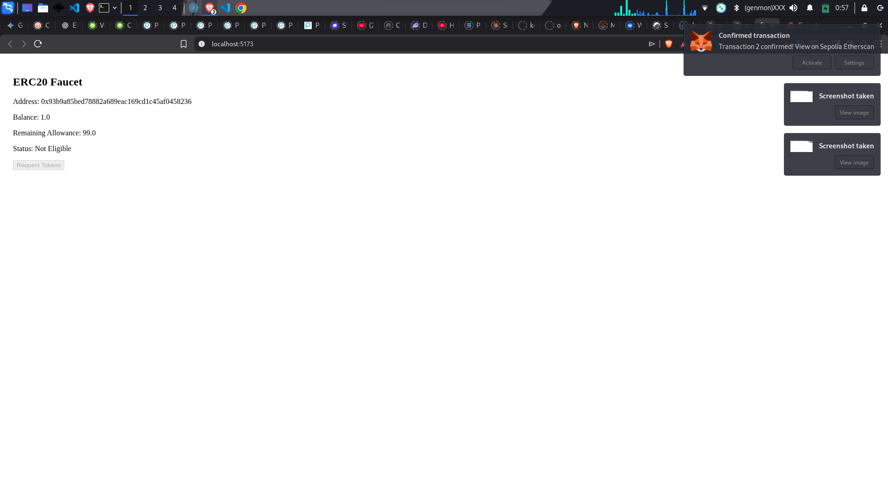

# ERC-20 Token Faucet DApp (Sepolia)

## Project Overview
A full-stack decentralized application allowing users to claim test ERC-20 tokens (TKN) with on-chain rate limiting (24h cooldown) and lifetime limits (100 TKN).

## Live Demo
- **Live Video Url**: ([Live Video url](https://drive.google.com/file/d/1fJ3W2S6YW-O10uo9wHCLnLfiHLHtoqY8/view?usp=sharing))
- **Live Demo Url**: ([Live demo url](https://erc20-faucet-dapp.web.app/))

## Deployed Contracts (Sepolia)
- **Token Contract**: `0xFAf8bcC12213F555a114c24270A880b7652Df047` ([Etherscan Link](https://sepolia.etherscan.io/address/0xFAf8bcC12213F555a114c24270A880b7652Df047))
- **Faucet Contract**: `0x9b90453117e621453658329D14B46d88a62A6f16` ([Etherscan Link](https://sepolia.etherscan.io/address/0x9b90453117e621453658329D14B46d88a62A6f16))

## Architecture

*Explain the flow: User interacts with React, which uses Ethers.js to talk to Sepolia contracts via MetaMask.*

## Quick Start
1. `cp .env.example .env` (Add your RPC and Contract Addresses)
2. `docker compose up --build`
3. Access at `http://localhost:3000`
4. Health check at `http://localhost:3000/health`

## Design Decisions
- **Faucet Amount**: 1 TKN ($10^{18}$ base units) per request.
- **Cooldown**: 24 hours (86,400 seconds) to prevent spamming.
- **Supply**: Fixed 1,000,000 TKN max supply to ensure scarcity.

## Video Demo
[Link to Video (Loom/YouTube)]

## Screenshots
### Wallet Connection Request

### Wallet Connected

### Successful Claim

## Security & Optimization
- **Access Control**: Used OpenZeppelin's `Ownable` for `setMinter` and admin-only `setPaused`.
- **Checks-Effects-Interactions**: State is updated before calling `token.mint` to prevent reentrancy.
